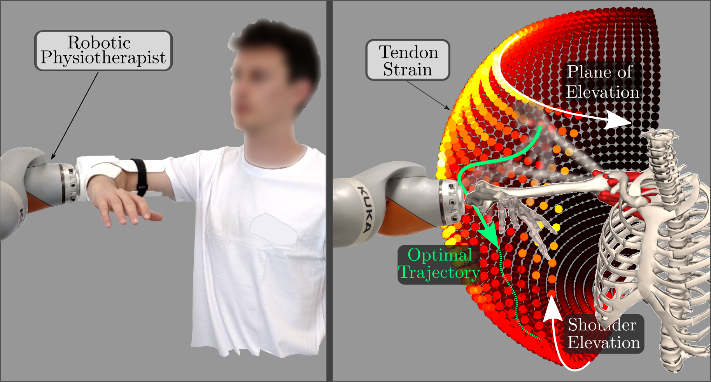
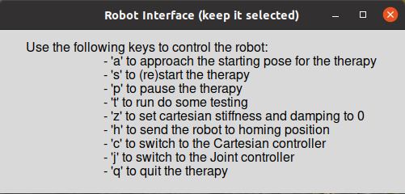
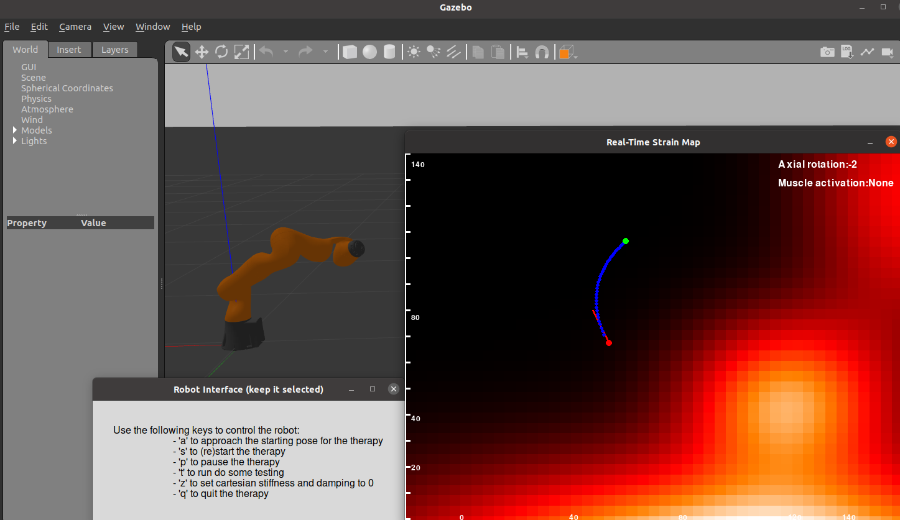

# BATON: Biomechanics-Aware Trajectory Optimization for Navigation during robotic physiotherapy
BATON is a novel method for planning biomechanics-aware robotic rehabilitation trajectories for rotator cuff therapy. It embeds a human musculoskeletal model into the robotic controller to plan trajectories that achieve a desired final human pose while minimizing strain in selected tendons and accounting for the dynamics of the human arm with which the robot interacts.

This version of the repository has been anonymized with https://anonymous.4open.science/anonymize for double-blind review.

## Features
When rehabilitating from rotator cuff tears, physiotherapy aims at gaining a large range of motion while avoiding injuries to the healing tendon(s). A robot that interacts with patients at this stage needs to have insights into the inner functioning of the human tissues. Our innovation consists in considering a [state-of-the-art biomechanical model of the human shoulder](https://simtk.org/projects/scapulothoracic) to extract:
- _strain maps_, which give insights into how tendons are elongated during the rehabilitation movement (as a consequence of the position of the patient, and of the activation in the corresponding muscles);
- _skeletal dynamics_, capturing the way in which the human position evolves as a function of torques applied to the human model.

These two elements are combined in an optimal control problem that can be solved efficiently in 0.12 s over a time horizon of 1 s divided into 10 steps.

We exploit a customized version of OpenSimAD that allows us to retrieve a differentiable expression for the dynamics of the original OpenSim model, and can be natively interfaced with CasADi.

## Requirements
In order to run `BATON` you will need:
- an OpenSimAD Conda environment to run the biomechanics-aware optimizations. This can be set up following the instructions at https://github.com/antoinefalisse/opensimAD;
- a ROS distribution (we tested our code with [ROS Noetic](http://wiki.ros.org/noetic));
- a working version of our `iiwa-ros` repository, implementing the impedance controller for the KUKA LBR iiwa collaborative robotic arm that we used in our experiments. Please refer to https://gitlab.tudelft.nl/kuka-iiwa-7-cor-lab/iiwa_ros for obtaining and building it correctly. Note that this repository has quite a few dependency, so make sure to follow the [instalation instructions](https://gitlab.tudelft.nl/kuka-iiwa-7-cor-lab/iiwa_ros/-/blob/main/README.md).

## Structure
Our code is organized as follows:
- [`Code`](https://github.com/itbellix/baton-robotic-rehab/tree/main/Code): this folder contains the code that you can run to explore the functionalities of `BATON` and reproduce its results, in simulation and on the Kuka robot (if you have previously installed the `iiwa-ros` repository). In particular:
    - `launch` contains the launch files that start the ROS master and take care of bringing up the impedance controller modules, together with Gazebo for simulation
    - `Python` contains the Python scripts specific to run `BATON` and reproduce our figures

- [`Musculoskeletal Models`](<https://github.com/itbellix/baton-robotic-rehab/tree/main/Musculoskeletal Models>): this folder contains the OpenSim models that we used with `BATON`. In particular, a reduced-order version of the [`thoracoscapular shoulder model`](https://simtk.org/projects/scapulothoracic) is considered, capturing the mobility of the glenohumeral joint and the musculo-tendon units spanning the joint.

Further explanations are provided inside each folder.

## Brief guide to our code
In order to run our code, you will need 3 different terminals (let's call them _terminal-1_, _terminal-2_ and _terminal-3_). On all of them, navigate to your local version of this repository, and source your ROS distribution, and the `iiwa-ros` (as `$ $PATH-to-iiwa$/iiwa_ros/devel/setup.bash`). Then, assuming that you are running things in simulation:
- on _terminal-1_: run `roslaunch Code/launch/controller.launch simulation:=true`
- on _terminal-2_: run `python Code/Python/robot_control.py --simulation=true`
on _terminal-2_: 
  1. activate the OpenSimAD Conda environment
  2. run `python Code/Python/TO_main.py --simulation=true`

If everything was installed correctly, you will see the Gazebo environment with the Kuka robot, and you should be prompted with a selection menu as below:

Then, you can input `a` so that the robot moves to the starting position for the therapy.
Once the position has been reached, you will see a strain map being brought up on the screen, and you will be able to input `s` so that the simulated experiment can start. By default, experiment 1 will be executed (where we assume position-dependent strains in the rotator cuff tendons).

Overall, the windows that you will see should look like, displaying the generation of rehabilitation trajectories that minimize the strain on the rotator cuff tendons:

### Trouble-shooting
If you encounter any troubles or issues with running the code contained in this repository, feel free to open an issue and report it. We will do our best to help you!

## License
Our code is licensed under the Apache 2.0 license (see the `LICENSE_code` file), while the data and models are licensed under CC BY 4.0 Use Agreement terms.

## Contributors
Italo Belli
